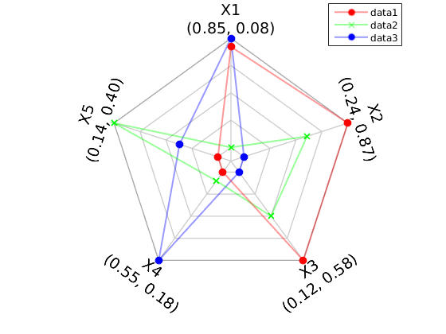
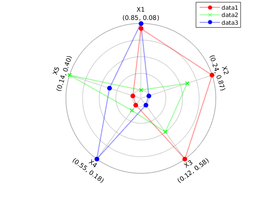
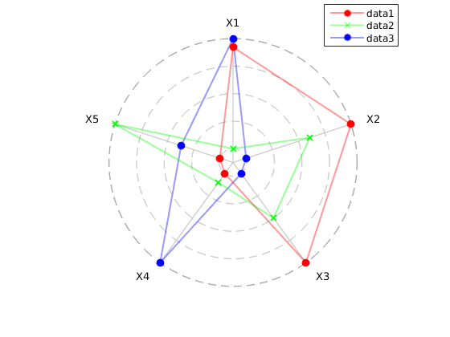

Matlab code for radar/spider type of plot. The code was inspired by implementation of
[David Said](https://www.mathworks.com/matlabcentral/fileexchange/33134-radar-plot).

Examples of such graps generated by radar_plot_examples.m script:

